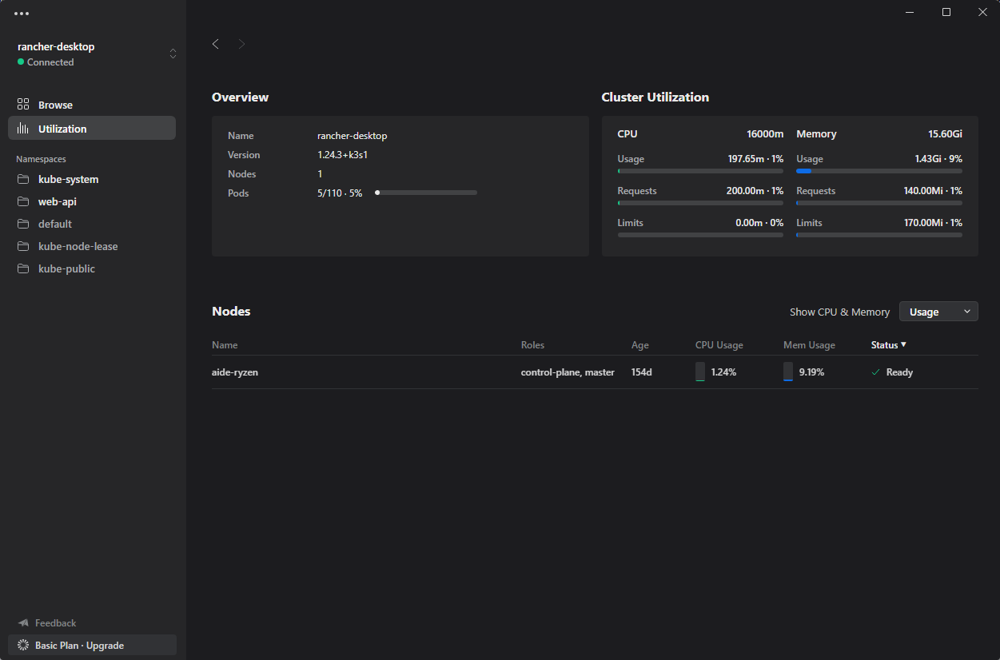

# The Simplest Kubernetes Desktop Client
Instantly manage and monitor Kubernetes from your Desktop.




## Develop

How to use this library:

1. Download and install [nwjs](https://nwjs.io/)

```bash
go mod tidy

go build .
nw .
```